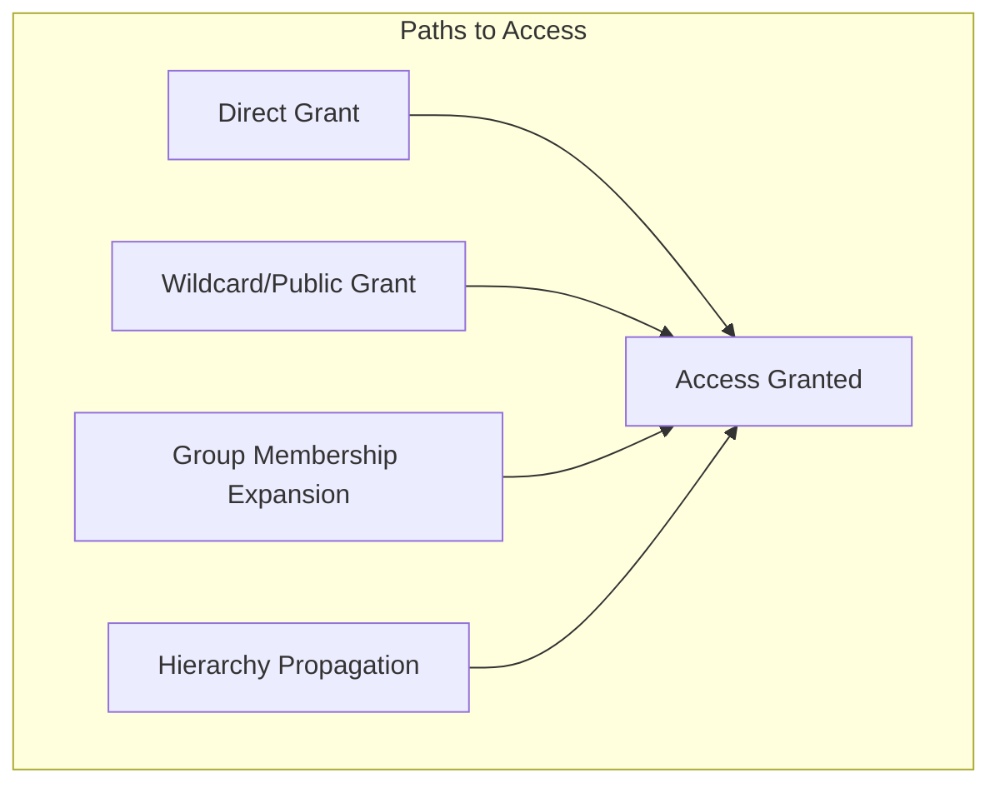

# How a Check Resolves

When you call `authz.check()`, polizy doesn't just look up a single record in your database. Instead, it runs an in-memory graph traversal algorithm to find any valid path of relationships that connects the subject to the object. 

Here is a conceptual walkthrough of how a check expands, how polizy remains fast and safe, and how you can debug the resolution path.

---

## The Path Expansion

For any given check—for example, *can Alice edit Document A?*—polizy begins by looking at your schema to see which relations satisfy the action `edit`. If the schema maps `edit` to the `owner` and `editor` relations, polizy will search for a path using either relation.

To find a path, polizy expands its search across four distinct types of grants:



### 1. Direct Grants
First, polizy looks for a direct connection. Is there a stored tuple directly linking the subject to the object?
* *Example*: `(user:alice, editor, document:docA)` immediately resolves the check to `true`.

### 2. Wildcard/Public Grants
Next, polizy checks for wildcard access. Has the relation been granted to "everyone" of the subject's type?
* *Example*: `(everyone("user"), viewer, document:public-doc)` means any subject of type `user` will pass the `viewer` check on this document.

### 3. Group Expansion
If no direct or wildcard grants exist, polizy checks if the subject belongs to any groups (e.g., teams, departments) that have access.
* *Example*: If `team:engineering` is an `editor` of `document:docA`, and `user:alice` is a `member` of `team:engineering`, the check resolves to `true`. 
* **Nested Groups**: This expansion is recursive. If Alice is in `team:frontend`, which is a member of `team:engineering`, polizy will traverse both steps to grant access.

### 4. Hierarchy Propagation
Finally, polizy looks "up" the resource hierarchy to see if the object inherits permissions from a parent container.
* *Example*: If `document:docA` has a parent folder `folder:project-alpha`, polizy checks if Alice has permissions on `folder:project-alpha`. If she can `edit` the folder, and the schema specifies that folder `edit` propagates to document `edit`, the check resolves to `true`.

---

## Efficiency and Safety

Searching a relationship graph can quickly become expensive, especially with large teams and deep folder structures. polizy implements several safety nets and optimizations to keep checks fast and predictable:

### Memoization
To prevent redundant database queries and CPU cycles, polizy uses per-check memoization. If the traversal visits the same group or folder multiple times along different paths, it retrieves the already-resolved result from memory instead of executing a new lookup.

### Cycle Safety
In complex systems, relationships can accidentally become cyclical (e.g., `team:A` is a member of `team:B`, which is a member of `team:A`). If a traversal loop is detected, polizy cuts off the path immediately and treats the loop as yielding no access, preventing infinite recursion.

### Depth Limits
To protect your application from runaway queries or excessively deep hierarchies, polizy caps the maximum number of traversal hops. 

* The maximum traversal depth defaults to **20** (configured via `defaultCheckDepth`).
* If a path exceeds this limit, polizy looks at the `maxDepthBehavior` configuration:
  * `"throw"` (default): Throws a `MaxDepthExceededError`. This is the recommended "fail-closed" behavior that alerts you to schema or data loops.
  * `"deny"`: Quietly logs a warning and terminates the path as unsuccessful (evaluating to `false`).
* **Exception for `explain()`**: The `explain()` API never throws `MaxDepthExceededError`. Because it is a diagnostic interface, it fails soft and returns `{ allowed: false, via: null }` if the cap is exceeded, even if `maxDepthBehavior` is configured to `"throw"`.

---

## Listing and Debugging

Graph traversal can sometimes feel like a black box. polizy provides built-in tools to inspect and trace exactly how these paths resolve.

### Explaining Decisions
If you need to audit or debug why a user was granted (or denied) access, you can use the `explain()` method:

```typescript
const explanation = await authz.explain({
  who: { type: "user", id: "alice" },
  canThey: "edit",
  onWhat: { type: "document", id: "docA" }
});

console.log(explanation);
// => {
//   allowed: true,
//   via: {
//     kind: "group",
//     relation: "member",
//     through: { type: "team", id: "engineering" },
//     via: { kind: "direct", relation: "editor" }
//   }
// }
```

The resulting tree maps out the precise path—whether direct, group, wildcard, or hierarchy—that satisfied the check.

### Reverse Expansion
Sometimes you need to know more than just a single "yes" or "no". polizy supports reverse graph expansion:
* `listAccessibleObjects()`: Finds all objects of a given type that a subject has permission to access.
* `listSubjects()`: Finds all subjects that are authorized to perform a specific action on a given object.

For a detailed guide on how to use these debugging and listing tools in your application, check out [Listing and Debugging](../guides/listing-and-debugging.md).
